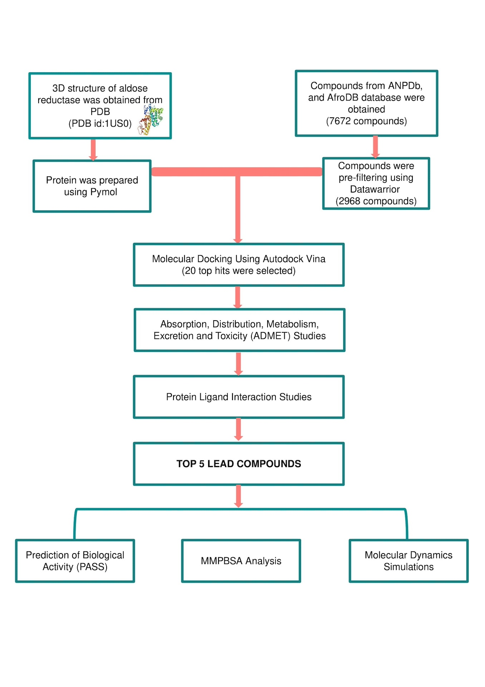

# aldosereduct2d

IN-SILICO SCREENING OF NATURAL COMPOUNDS AS POTENTIAL INHIBITORS OF ALDOSE REDUCTASE IN THE MANAGEMENT OF DIABETIC COMPLICATIONS

## Table of Content

[Introduction](https://github.com/omicscodeathon/aldosereduct2d#introduction)

[Objectives](https://github.com/omicscodeathon/aldosereduct2d#objectives)

[Research Methodology](https://github.com/omicscodeathon/aldosereduct2d#research-methodology)  

[Molecular Docking Results](https://github.com/omicscodeathon/aldosereduct2d#results)

[Docking Validation](https://github.com/omicscodeathon/aldosereduct2d#validation-of-docking-protocol)
  
[Pharmacokinetics Properties of Predicted Compounds](https://github.com/omicscodeathon/aldosereduct2d/#absorption-distribution-metabolism-excretion-and-toxicity-admet-prediction)
  
[Protein-Ligand Interaction of Top Lead Compounds](https://github.com/omicscodeathon/aldosereduct2d#protein-ligand-interaction-of-top-lead-compounds)

[PASS](https://github.com/omicscodeathon/aldosereduct2d#pass)

Reproducibility

Discussion

Team

Acknowledgment

References

## Introduction

Diabetes mellitus (DM) remains a leading cause of morbidity and mortality globally, primarily due to chronic microvascular and macrovascular complications. These complications arise as a result of the activation of certain biological pathways that increase the accumulation of reactive oxygen species (ROS) and cytokines thereby inducing inflammation and oxidative stress.
Globally, the incidence of diabetes mellitus has surged to epidemic levels, especially in lower and middle-income countries. According to the 2021 International Diabetes Federation (IDF) report, DM affects approximately 575 million adults (20-79 years), who make up 10.5% of the world's population. By 2045, this number is projected to increase to 12.5% ( IDF Diabetes, 2021). 

**Aldose reductase (AR)** is a key enzyme of the polyol pathway that catalyzes NADPH-dependent reduction of glucose to sorbitol however, increased enzyme activity and excessive accumulation of intracellular sorbitol under hyperglycaemic conditions have been proposed to be an important factor in the development of diabetic complications. Over the years, inhibiting AR has emerged as a crucial strategy for preventing and mitigating long-term diabetic complications. However, drug development efforts targeting AR have encountered significant challenges, which include toxicity, adverse reactions, and lack of specificity. This study aims to explore active compounds indigenous to the African region, _which exhibit high specificity as potential AR inhibitors_, thus presenting viable prospects for pharmacological intervention.

## Objectives
Specific Objectives 
1. To predict lead compounds through structure-based virtual screening.

2. To characterize the pharmacological and physicochemical properties of the selected lead compounds.

3. To  elucidate  the  inhibitory  activity  of  the  lead  compounds  using the prediction  of  activity spectra for substances

4. To determine the stability of the docked complexes using molecular dynamics simulation

## Research Methodology

## Results
### Molecular docking

### Absorption, Distribution, Metabolism, Excretion, and Toxicity (ADMET) Prediction

### Protein-Ligand Interaction of Top Lead Compounds

###  PASS 

### Molecular Dynamics Simulations

### MMPBSA Analysis of Interactions

## Discussion

Five natural compounds namely (+)-pipoxide, Zinc000095485961, Naamidine A, (-)-pipoxide, and 1,6-di-o-p-hydroxybenzoyl-beta-d-glucopyranoside were found to be potential inhibitors of aldose reductase. Molecular docking results showed these compounds to have binding energy between -12.3 and -10.7 Kcal/mol which was higher than standard inhibitors used in the study. ADMET and protein-ligand interactions showed that while these compounds interact with active site amino acid residues through hydrogen bond interactions, they possess good pharmacological and low toxicity profiles. Prediction of biological activity showed Zinc000095485961, and 1,6-di-o-p-hydroxybenzoyl-beta-d-glucopyranoside to possess aldose inhibitory activity. Molecular dynamics simulations showed that the compounds bound to AR showed high stability and less conformational change to the protein.
Conclusion: This study highlights the potential inhibitory activity of these compounds aldose reductase protein that can be found within the African region and used in the development of therapeutic agents to manage diabetes

## Contributions to the field
The study significantly contributes to the field of in-silico drug design by identifying novel African natural compounds with promising pharmacological profiles for inhibiting aldose reductase. This is particularly relevant due to the existing limitations of approved aldose reductase inhibitors, which are often associated with adverse side effects. By pinpointing five natural compounds, the research offers potential alternatives that are predicted to exhibit molecular stability and interact with critical residues within the aldose reductase binding site. Overall, the study sheds light on the inhibitory mechanisms of these compounds and their potential efficacy as aldose reductase inhibitors.

## Team
. Miriam E.L Gakpey1
. Shadrack A. Aidoo
. Toheeb Jumah
. Siyabonga Msipa
. Florence N. Mbaoji
. Omonijo Bukola
. Christabela P. Tjale
. Mamadou Sangare
. Hedia Tebourbi
. Olaitan I. Awe

## Acknowledgment
The authors thank the National Institutes of Health (NIH) Office of Data Science Strategy (ODSS) for their immense support before and during the April 2024 Omics codeathon organized in collaboration with the African Society for Bioinformatics and Computational Biology (ASBCB).

## References
1. Ashik, M. A., Islam, T., Fujii, M., Alam, M. M., & Hossain, M. N. (2022). Interaction pattern of aldose reductase with β-glucogallin: Active site exploration and multiple docking analyses. Informatics in Medicine Unlocked, 30, 100938. https://doi.org/10.1016/j.imu.2022.100938
   
2. Fidele Ntie-Kang, Telukunta, K. K., Kersten Döring, Simoben, C. V., Aurélien F. A. Moumbock, Malange, Y. I., Njume, L. E., Yong, J. N., Sippl, W., & Günther, S. (2017). NANPDB: A Resource for Natural Products from Northern African Sources Journal of Natural Products, 80(7), 2067-2076. https://doi.org/10.1021/acs.jnatprod.7b00283

